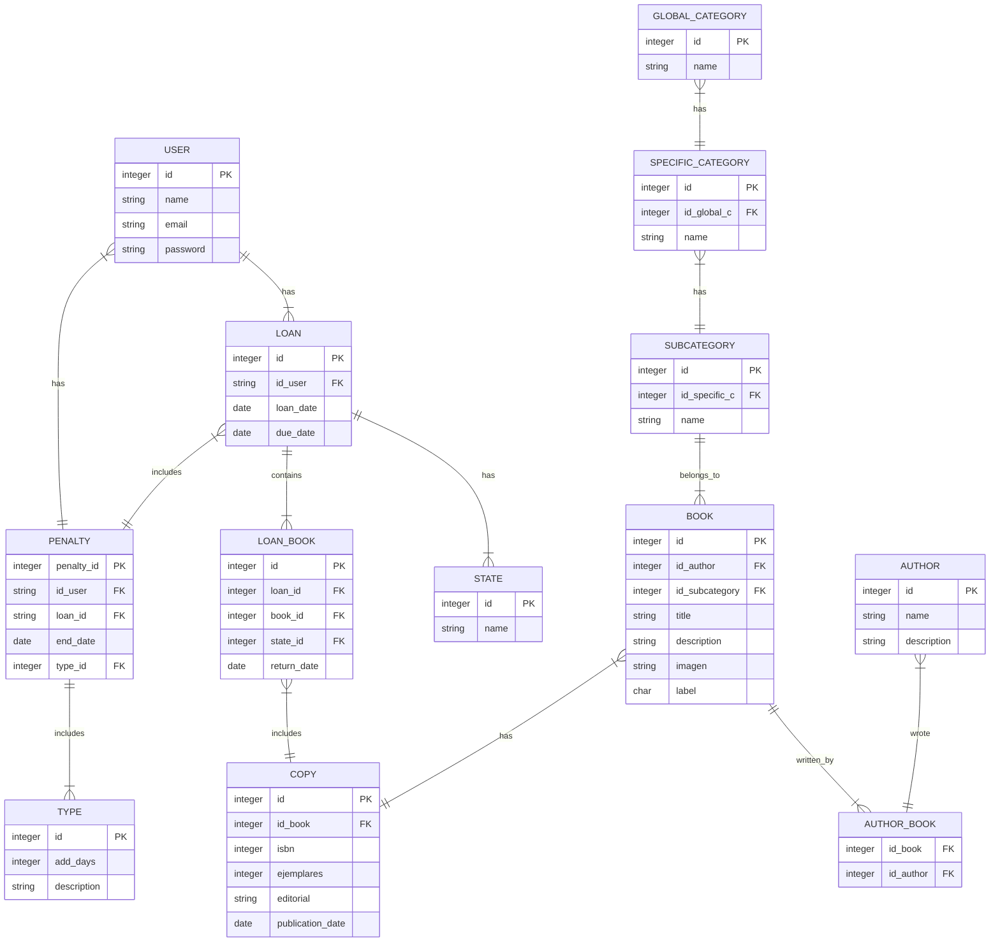
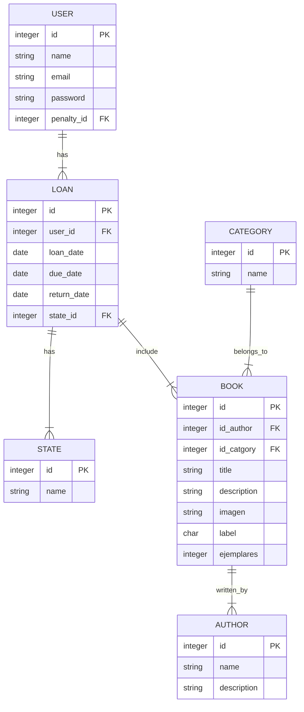

# PFC: Letras

> **Comienzo**
> En un principio la idea principal almacenar los datos en una base de datos MySql en un docker con mySql y un administrador.

> **Evolución**
> Debido a la complejidad del modelo y a tener que realizar muchas tablas intermedias para poder realizar almacenamientos sencillos como que un libro tuviera más de un autor, que hubiese varias categorías y otras funcionalidades que se pudieran incrementar, del tipo: comentarios de libros o puntuaciones. Me decante por un modelo de base de datos no relacional, concretamente Mongodb, por lo que realice otro docker pero el proceso de autentificación causaba conflictos ya que el script del docker por alguna razón que aún no he alcanzado a comprender, fallaba la autentificación 10 veces y aunque se pudiera acceder desde el puerto 8080,  introduciendo las credenciales manualmente, a la hora de conectarse desde spring boot, este proceso lo rechazaba.

> **Solucion**
> Investigando encontré que que Mongodb proporciona un servidor de base de datos en la nube, que es gratuita parcialmente, es decir, solo puedes tener un servidor (cluster) y este se encuentra en un entorno de pruebas. Por lo que decidí probarlo y la conexión es más sencilla de lo que me esperaba por lo que he decidido investigar como puedo utilizarlo en mi aplicación.

> **Próximos pasos**
> Seguir investigando y en paralelo al estar realizando el proyecto de la api de juegos en las prácticas me he dado un margen de dos semanas y media para realizar pruebas y si finalmente está solución no es viable presentaría lo que tuviera del proyecto de las prácticas y trabajaría un poco más en ello.
> Mi objetivo principal es dejar de lado la idea de utilizar otras herramientas de springboot del tipo spring security y centrarme en el acceso, la modificación y el tratamiento de los datos desde la aplicación a mongo Atlas y a crear una interfaz similar a la creada en el prototipo de figma.



> **Porque serían necesarias tantas clases**
> Que exista una **tabla intermedia entre el prestamos y las copias** de los libros, permite poder tener varios libros asociados a un mismo préstamo sin perder la opción de devolver cada libro por separado.
> 
> La **tabla copia** permite que la biblioteca pueda tener diferentes copias del libro con su respectiva editorial, si está a cambiado en algún momento o la fecha de publicación, pudiendo tener diferentes copias.
> 
> Que haya una **tabla intermedia entre libro y autor** permite una relación de muchos a muchos, es decir, que un libro pueda tener varios autores y que un autor pueda tener varios libros.

### ¿Como se podría simplificar?
> **Simplificar el modelo de datos**
> Simplificar las tablas podría suponer los siguientes inconvenientes: 
> 1. Que se almacenen bastantes valores nulos ya que un usuario podría no tener penalizaciones o causar ciertos errores en el momento de quitar, comprobar o insertar una penalización si no existe un procedimiento automatizado para ello.
> 2. Que no se pueda almacenar un libro con varios autores.
> 3. Que el libro si existen ejemplares de diferentes ediciones, cuyos cambios podrían ser relevantes para su buena gestión.



## Re-dirección del modelo: NoSQL

En un entorno no relacional, se podria utilizar una base de datos orientada a documentos como MongoDB. Permitiendo simplificar el modelo de datos en formato de documentos:

### Modelos propuestos:
#### Author

```json
{
  "_id": "ObjectId(...)",
  "name": "...",
  "description": "Descripción del autor"
}
```

#### Category

```json
{
	"_id": "X00",
	"name": "<Nombre de la categoria>",
	"specific_category": 
	[
		{
			"_id": "X10",
			"name": "<Primera catgoria especifica>",
			"subcategory":
			[
				{
					"_id": "XX1",
					"name": "<Primera subcatgoria>"
				},
				{
					"...":"...",
				}
			]
		},
		{
			"...":"...",
		},
	]
}
```
#### Book

``` json
{
  "_id": "ObjectId(...)",
  "title": "...",
  "imagen": "...",
  "subcategory_id": "ObjectId(...)",
  "copies": "X",
  "publication_date": "IsoDate(XXXX-XX-01T12:00:00Z)",
  "isbn":"XXXXXXXXXXXXX",
  "label": "X-XXX-XXX",
  "description": " ... ",
  "authors": [
    "ObjectId(...)",
    "ObjectId(...)",
    "..."
  ],
  
  "reviews": [
	  {
		  "id_user": "ObjectId(...)",
		  "review": "...",
		  "puntuation": "..."
	  },
	  {
		  "id_user": "ObjectId(...)",
		  "review": "...",
		  "puntuation": "..."
	  },
	  {
		  "...":"..."
	  },
  ]
}
```

> **Extra**
> En un principio las "reviews" no son mi prioridad, pero me resulto un ejemplo muy claro de porque hacer la base de datos no relacional y sería sobretodo, por la comodidad de poder incorporar funcionalidades, que en un modelo de datos relacional sería demasiado complejo, y sin embargo, sería una solucion posible para realizar pruebas. Pudiendo utilizarlo incluso para ordenar por puntuación.

#### User

```json
{
  "_id": "ObjectId(... )",
  "name": " ... ",
  "email": " ... ",
  "password": " ... "
}
```
### Otros modelos propuestos
En un principio el objetivo principal es lograr: Crear un login y registro (Sin autentificación en spring security) y una página principal que muestre los libros, filtre y busqué. Con la posibilidad de incorporar los datos de una Api externa tipo google books, aunque tendría que mirar como hacerlo, ya que las categorías suelen ser distintas y en inglés, por lo que quizás tendría que ver la forma de filtrar los datos y transformarlos. 

Si el tiempo lo permite la idea es implementar otras funcionalidades como pudieran ser: Solicitar una reserva y gestionar el estado de prestamos, en el sentido de si una reserva va a caducar poder actualizarla y gestionar las penalizaciones.

#### Préstamo

```json
{
  "_id": "ObjectId(...)",
  "loan_date": "ISODate(YYYY-MM-DD)",
  "due_date": "ISODate(YYYY-MM-DD)",
  "state": "ObjectId(...)",
  "books": [
    {
      "book_id": "ObjectId(...)",
      "book_status": "ObjectId(...)",
    },
    {
      "book_id": "ObjectId(...)",
      "book_status": "ObjectId(...)",
    }
  ]
}


```

#### Usuario

```json
{
  "_id": "ObjectId(...)",
  "name": "Nombre del usuario",
  "email": "correo@ejemplo.com",
  "password": "contraseña_hash"
}
```

#### Penalización

```json
{
  "_id": "ObjectId(...)",
  "end_date": "ISODate(YYYY-MM-DD)",
  "type_id": "ObjectId(...)"
}
```
## Enlace protitipo y pruebas figma:
https://www.figma.com/community/file/1372199110003262894
